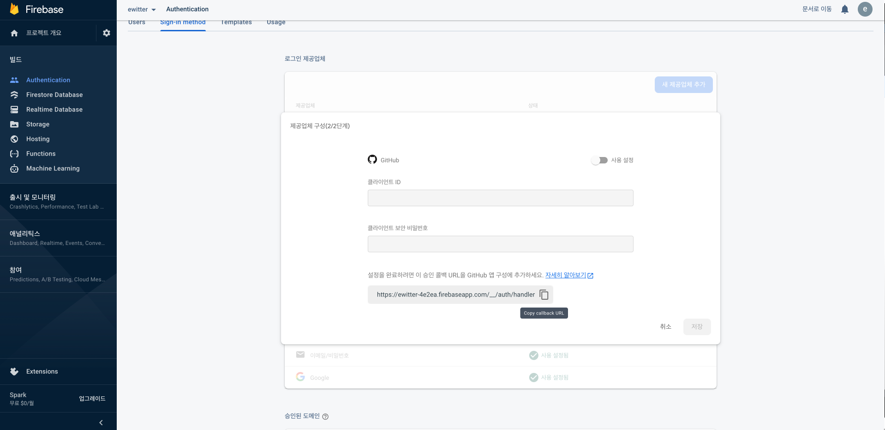
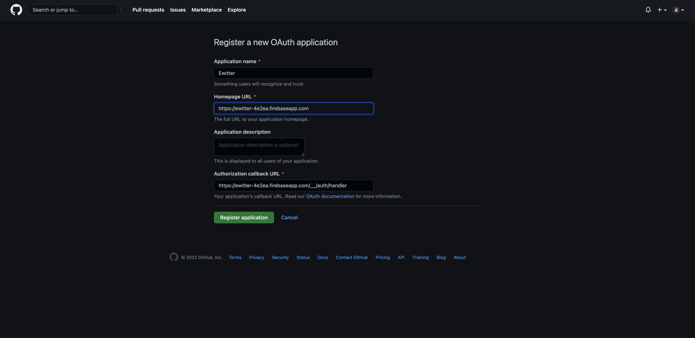

# Login form

- firebase를 통해 로그인, 인증할 소셜 매체 설정

## Authentication 설정(로그인 연동)

path: https://console.firebase.google.com -> Authentication -> Sign-in method -> 새 제공업체 추가

_프로젝트가 생성되어 있어야 함_

## Log in with Github

1. Get a github callback URL
   

2. Github developer settings
   

3. Get a Client ID and Client Secrets (developer settings)
4. firebase에 기입
