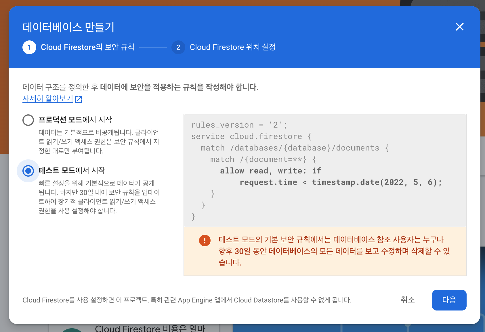

# Form and Database Setup

- Home의 text input 추가 및 database 환경 세팅

## add database


- 데이터베이스 만들기 선택



- 프로세스대로 실행

## import database

fbase.js

```javascript
import 'firebase/database';
...
```

[사이트참조](https://nomadcoders.co/nwitter/lectures/1918)
