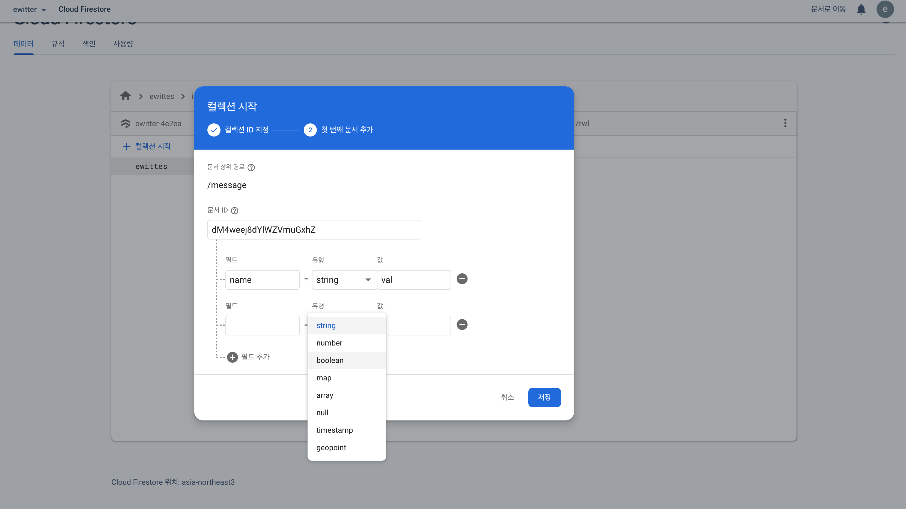
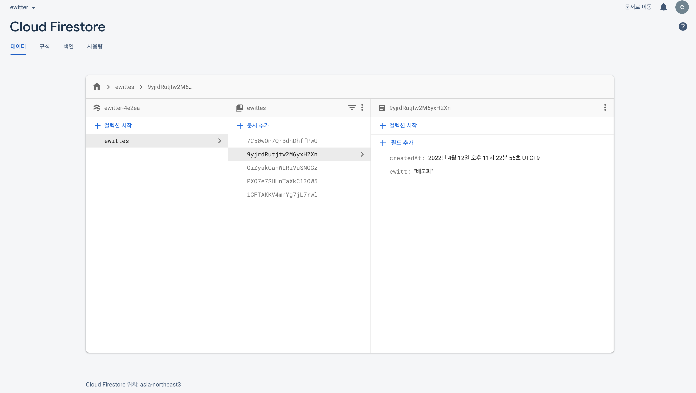

# Start Collection

- cloud firebase는 프로그램이 필요없고, 유연함을 가지고 있음

## firesotre 과 NoSQL의 특징

- Collection, document를 가지고 있음
- collection은 폴더와 같음
- document는 문서, 텍스트와 같음
- collection은 document를 가진다

## start collection



## set firestore

firebase.js

```javascript
import { initializeApp } from 'firebase/app';
import { getAuth } from 'firebase/auth';
import { getFirestore } from 'firebase/firestore'; //추가
import 'firebase/database';

...
export const dbService = getFirestore();
```

Home.js

```javascript
import { collection, addDoc, serverTimestamp } from 'firebase/firestore'; //추가
import React, { useState } from 'react';
import { dbService } from '../fbase';

const onSubmit = async (e) => {
  e.preventDefault();
  await addDoc(collection(dbService, 'ewittes'), {
    ewitt,
    createdAt: serverTimestamp(),
  });

  setEwitt('');
};
```

-ewittes collection 에 submit한 값들을 추가

## firestore에 저장된 모습



[사이트참조](https://firebase.google.com/docs/storage/web/start?hl=ko&authuser=1)
